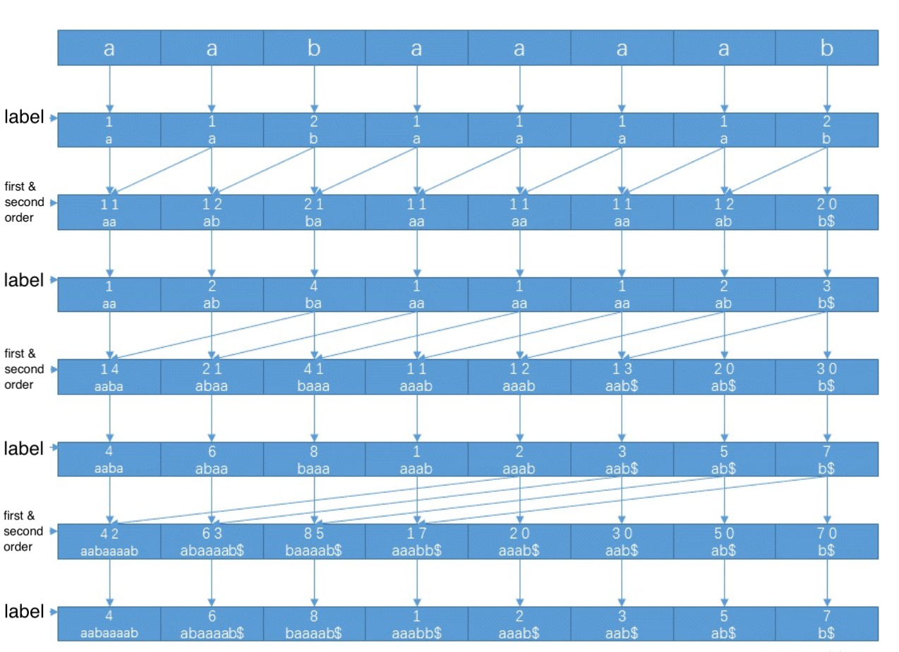
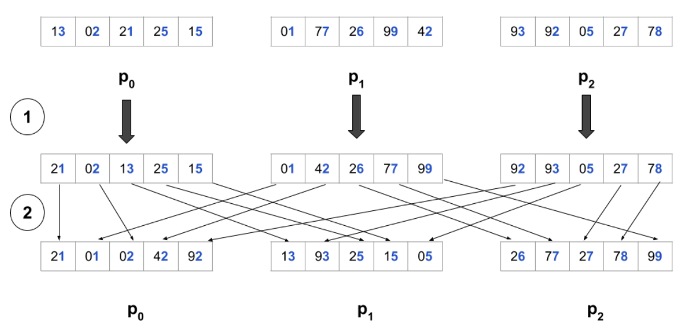

# Parallel Suffix Array Construction
Members: Chengji Yu (chengji2), Sree Revoori (srevoori)


### Summary

We tried different parallel strategies on different algorithms for suffix array construction mainly on the CPU but also tried on GPU. Observing the speedup or the drop-off we got from different strategies, we proposed our explanation and our analysis on the trade-off between simple parallelizable algorithms and elaborate serial algorithms with high-efficiency.


### Background

##### Introduction

A suffix array is a data structure that contains the sorted suffixes of a string. In contrast to suffix trees, they are extremely space efficient since we can compress each suffix to an integer, i.e. let the index the suffix starts on denote the suffix. As an example, say we want to construct a suffix tree for the string `s = banana$`. We first index each suffix and represent by `S[i]` based on the index it starts at.

| S[i]    |  i   |
| ------- | :--: |
| banana$ |  0   |
| anana$  |  1   |
| nana$   |  2   |
| ana$    |  3   |
| na$     |  4   |
| a$      |  5   |
| $       |  6   |

After sorting the indices based on the suffix starting at that index, we get the sorted suffix array, represented by array `SA`.`SA[i]` means the index that the i-th smallest suffix starts on the input string. 

|  i   | SA[i] | S[SA[i]] |
| :--: | :---: | :------: |
|  0   |   6   |    $     |
|  1   |   5   |    a$    |
|  2   |   3   |   ana$   |
|  3   |   1   |  anana$  |
|  4   |   0   | banana$  |
|  5   |   4   |   na$    |
|  6   |   2   |  nana$   |

Thus, our suffix array `SA` is [6,5,3,1,0,4,2].

In this program, we construct a suffix array `SA` given a string. The scope and time complexity of a specific algorithm and parallel strategy could vary a lot with different input alphabet size. For conciseness, we use constant-sized alphabet, i.e., positive 8-bit integer to represent each character in the input. As a result, the data structures for different algorithms and parallel strategies are the same - an `std::string` and an `std::vector` of integers.

Although not immediately clear, suffix arrays have numerous applications in string problems such as longest palindromic substring, needle in haystack string search, longest common substring, and longest repeating substring. 

##### Algorithms

We adopted four algorithms and implemented the sequential version of them.

* **Brute force sorting**

  An O(n<sup>2</sup>logn) algorithm is obvious - just find each substring and sort the array. The sorting for an array with N elements requires O(nlogn) comparison and each comparison for two substrings is in O(n). The brute force sorting time scales super-linearly with the input size N. Therefore, the time cost for this algorithm might be very large even it reaches a fairly good speedup with parallelism. We will only use this implementation as a reference for other algorithms.

  Though the algorithm is simple, the implementation can significantly reduce the performance. The code we implemented before the milestone used literally substrings for comparison so the memory cost would be nontrivial. By optimizing the data structure and overriding the comparison function, the time cost for constructing a random string was reduced from ~0.5 seconds to less than 0.1 seconds.

* **Divide and conquer**

  This algorithm uses the idea of divide and conquer to realize an O(nlog<sup>2</sup>n) to at worst O(n<sup>2</sup>log<sup>2</sup>n) time complexity (depends on different problem sets). Different from brute force sorting, we have a list of target suffixes to sort. Then we first sort the suffixes by a specific range of characters in the suffix. We use a red-black tree to store the sorting result and each leaf on the tree has a list to store suffixes. The suffixes fall into the same leaf on the RB tree should have exactly the same substring with a certain length. So for each element in the target suffixes list, we look up the key (i.e., the substring in particular range). If found, we add this suffix into the corresponding leaf's list. Otherwise, we insert a new leaf with the substring as the key. Finally, we traverse the RB tree. If the length of the list is one, then the suffix in that list is unique, which means the order of this suffix is determined. Otherwise, we save the list of suffix in the leaf as the target suffixes list in the next iteration. Each target suffixes list comes with a specific area in the output array. This area is the places that these suffixes have in the final sorted suffix array.

  After each iteration (RB tree construction and traversal), we move the index of the substring range to the right of the previous range and double the length of substring. For example, when we are operating the suffix `S[k] = str.substr(k, len=n - k)`, in the first iteration, the length of the substring is 1 and the substring we use as the key for RB tree is `str[k]`. If the list of suffixes where `S[k]` exists has other suffixes, then this list would be pushed to the queue for the second iteration. In the second iteration, the length of substring is 2 and we use `str[k+1], ..., str[k+2]` as the key. Then we use `str[k+3], ..., str[k+6]`, `str[k+7], ..., str[k+14]` as the keys if these keys are also the substring of some other suffixes.

  The computational expense is mainly about storage. We tried both iterative and recursive implementation. The large queue for iteration and the overhead for deep recursion would influence the performance. Though the two have similar performance after optimization, it still requires more memory operation than any in-place sorting.

  The good thing is the obvious potential parallelism between subtasks. If the length of the list on the leaf is one, then there won't be any further task. If not, then the new target list of suffixes is unique among all the leaves and the tasks should be fully independent. Therefore, simple multi-tasks parallelism should work. In general cases, the sequential part is only the first RB tree construction and the propotion of parallelism should be fairly high.

* **Construct with radix sorting**

  In this algorithm, the O(nlogn) time complexity benefits from the idea of radix sorting. Different from the decimal digits, here we use the order of the substring as the label for radix sorting. Therefore, after the last sorting, the labels for the suffixes should be all unique and should be a permutation of `[0, ..., n - 1]`. At first, the length of substring is 1 and we label each suffix by this 1-length substring. By using counting sort (bucket sort), we reorder the labels in a continuous integer array starting from 0. Then we double the length and the labels for the suffixes are composed by two labels from the last iteration. This is similar to the higher digit and lower digit in radix sort. We have O(logn) iterations by doubling the length after iterations. By virtue of radix sort and counting sort, each iteration requires several O(n) traversals on all the suffixes. In total, it requires a stable O(nlogn) time.

  

  The algorithm implementation is more subtle and the data has strong connection with each other. Many `for` loops require to be run in order. That's being said, the data has a strong dependency. This not only makes it difficult to parallel, but also introduces cache conflicts to lower the speed. The parallelizable part of the implementation still exists and it has the potential to benefit from SIMD execution, vectorization, GPU execution, etc. 

* **Skew algorithm**

  This O(n) algorithm is very complicated and difficult to reproduce even the sequential version. Basically it comes up with the idea to divide the targets by moduloing 3. It sorts one of them with recursion inside the sorting algorithm. Then it utilizes the result to sort the others and finally merges the three parts using a specific comparator. We started from the code provided in the [paper](http://www.cs.cmu.edu/~guyb/realworld/papersS04/KaSa03.pdf) and modified part of the code.

  This algorithm must be implemented carefully. Because of the explicit division of work, it has the potential parallelism between tasks. However, considering the productivity and the scope of this project, we will use this algorithm as a performance reference but won't implement the parallel version.

##### Problem sets

In the main program, we provide three different string construction methods for test. After compiling the program with `make`, simply run the `suffixarray` executable file with arguments.

```bash
  -t  --threads <N>         Use N threads
  -r  --random (default)    Randomly generate a string
  -a  --alphabet            Generate a test string by replicating the alphabet 'abcd...xyz' so that adjacent 																suffixes are different
  -h  --hard                Generate the worst case that require the algorithms go into the final iteration. The 														 string will be 'aaaaa...aaaab'
  -m  --manual <string>     Specify input string. No longer than 256. The input string will be replicated to the 														 length of the defined length
  -?  --help                This message
```

All the string will be replicated to the length of 90000 for test if it was shorter than this number.

We also have different compile options to specify which parallel strategy to use. We use this way to prevent unnecessary branching while compiling. Details would be introduced in the next section.

```bash
# Remember to run `make clean` if nothing is compiled
# compile command: make OPTIONS="xx xx xx"
# replace xx with your options:
-DATOMIC_RADIX 							# test atomic operation in radix sort. This option will ignore the below two.
-DUSE_CUDA 									# use CUDA in radix sorting
-DOMP_RADIX 								# test local accumulation with omp in radix sorting
-fno-tree-vectorize 				# compile without vectorization
-ftree-vectorizer-verbose=1 # see the log for vectorization result
```


### Approach

##### Parallel divide and conquer algorithm

Because of the independency among the sub-tasks, we assign the tasks to threads **using OpenMP on CPU**. We initialize the OpenMP threads by `omp_set_num_threads`. To balance the work loads for each threads, we use the `dynamic` pattern in the `omp` instructions. The data structure keeps the same as we use a new list to store the targets for a task. By virtue of OpenMP, we can simply pass the target list to the function which is responsible for one sub-task at a time. The building process of the target list and the calculation for its range in the final output need to be carefully implemented.

In the above implementation, we **split the work load by using the first character** of the string as the keys. In that case, the number of tasks is at most the alphabet size. We tried to split the work load by using the first two characters of the string so there would be more tasks and the work load distribution should be more balanced. However, due to the increasing propotion of sequential calculation, i.e., the first iteration on the two characters, the speedup was lower than the previous implementation. Meanwhile, the overhead of creating and operating OpenMP threads increases. Therefore, this attempt did not work well for better speedups than the initial one.

##### Parallel the algorithm that uses radix sorting

Most steps of this algorithm are traversing the whole array in order. And the value to store for each element in each iteration is not deterministic. This **strong dependency** prevents us from splitting the work load into many processors. Therefore, we digged into each traversal and looked for the potential opportunities to parallelize.

* **Vectorization**

  For the traversal with changing counter (the variable `p` in the code), the upcoming element does not know its `p` value until the previous store is executed so it's hard to parallelize. Some others can be optimized by vectorization and SIMD instructions. For example, these traversals are vectorized by the compiler:

  ```c++
  for (int i = 0; i < n; i++) { // Vectorizable
      label[i] = (int)str[i];
  }
  ...
  for (int i = n - len; i < n; i++) { // Vectorizable
      second_order[p++] = i;
  }
  ```

  If we use `-O2` or `-O3` optimization to compile the program, it will automatically vectorize the `for` loops. We use `make OPTIONS="-ftree-vectorizer-verbose=1"` to see the log for vector optimization:

  ```
  ...
  radixsort.cpp:129: note: LOOP VECTORIZED.
  radixsort.cpp:119: note: vectorized 3 loops in function.
  ...
  ```
  
* **Multi-thread atomic addition**

  One of the traversal inside the counting sort is to count the numbers of different labels. It simply adds the count indexed by the label by 1.

  ```c++
  for (int i = 0; i < n; i++) {
      cnt[label[i]]++;
  }
  ```

  Accessing the array might require long communication for a large array. So we tried to let different threads work on partial of the full array, load the value in `label[i]`, locate where the `cnt` element is, and do the atomic addition to update a global `cnt` array. The data still has strong relation so we are using CPU instead of GPU. We use the `pthread` library with static work assignment, and use the `atomic` library for atomic operations.

* **Multi-thread local sum and reduction**

  For the same code snippet above, the cache conflicts should be time consuming because the value of `label[i]` is not continuous so this code has a poor locality. So it might be a good idea to split the work for different threads with static assignment, and **accumulate on a local array and finally reduce among all the threads**. The work for threads is supposed to run in sequential so we also use CPU. We use OpenMP for simple threads operation and use OpenMP atomic feature for the reduction.

* **Parallel inclusive prefix sum**

  Another traversal inside the counting sort is inclusive scan.

  ```c++
  for (int i = 1; i < bucket_size; i++) {
      cnt[i] += cnt[i - 1];
  }
  ```

  Recall that in the assignment 2, we have implemented a parallel version of exclusive scan, which decreases the time span to O(logn) on GPU. For the radix sorting algorithm, the `bucket_size` is the number of different labels. This size is increasing until the very last iteration after which the size should be the same as the input size `n`. Therefore, parallelizing this code should be helpful when `n` is **significant large**. Before each radix sorting, we copy the data from host to the GPU device. After the inclusive scan, we copy the data back to the host. We use the `thrust` library for inclusive scan.

* **Parallel the radix sorting**

  Finally, we discuss about this failure attempt. This idea is inspired from the general radix sort where each processors sort part of the data based on a uniform key digit. Then they sends and receives the specific portion of data from other processors and proceeds to the next digit. For instance, 5 processors process decimal integers. For the first iteration, each processor sorts its own data, keeps the data ends with i/N and sends out others. The first processor has xxx..xx0 and xxx..xx1. The second has xxx..xx2 and xxx..xx3. Then they sort the exchanged data based on the 2nd digit. And now first processor keeps and receives xxx..xx0x and xxx..xx1x.

  

  This diagram shows the first iteration of radix sorting, focusing on the least significant digit (LSD). The step 1 is to sort the partial data on individual processor. The step 2 redistributes the data. Note that during the redistribution, the processor 0 keeps its data 21 and receives the data with LSD=1 from other processors. Then the processor 0 keeps its data 02 which has LSD equal to 2, and receives data with LSD=2 from others. Therefore, each processor requires O(n) communication in each iteration to collect its new data(the processor saves a range of n/t digit value and for each digit value it communicates to all other t threads). So the number of communications is at least the number of calculation, no need to say the amount of bytes. The arithmetic intensity is very low in this case so it would not create an ideal speedup.

  The reason is the size of different digits for each iteration is fixed. In the above example, processor 0 will always keep the data with the digit 1 or 2. But in the suffix array construction, it might be 1, 2, ..., N/t, where t is the number of threads. This parallelization works for the general radix sorting is because the number of digits increases along with N. For suffix array construction with the idea of radix sorting, the number of digits is always two but the range of the digit value increases with the problem size N.


### Results

We look forward to optimizing different algorithms to see the changes from sequential to parallel implementations. We measure the time for solving different problems and the less time it costs, the better performance this algorithm has. The time unit in this report is in **milliseconds**.

As mentioned in the [problem sets](#problem-sets) section, we use three ways to construct the input string. The default string is generated randomly between 1 to 127. Another test case is to sort the string with the same characters except the last one, i.e., `aaaa...aaab` so that most of the suffixes are not able to be distringuished until we compare the characters in the end. For most algorithms we use, this is supposed to be the worst case. The last test string is designed to be the easiest case, however, it is actually more complicated than the random string. We duplicate the alphabets from `a` to `z` so this string is `abcd...xyzabc...`. Intuitively the adjacent suffixes can be easily distinguished so we thought this might outperform all other cases. Actually, the suffixes with interleaves of a multiple of 26 start with the identical characters so if they are grouped into the sub-tasks, it would require more time to sort them. We use **random**, **alphabet**, **hard** to represent these three problem sets.

Since the suffix array construction focuses more on the time cost with a large input data size, we unify the length to 90000 for all the input string. The varying conditions for experiments are problem sets, number of threads, and parallel options. Here we use single thread with default vectorization as the baseline.

```bash
# compile the program. Remember to run `make clean` if nothing is compiled
make
# run the program with different problem sets
./suffixarray -r
./suffixarray -a
./suffixarray -h
```

Sequential runtime baseline in milliseconds:

|                           | Random | Alphabet |   Hard   |
| :-----------------------: | :----: | :------: | :------: |
|        Brute Force        | 19.238 | 2242.981 | 3724.514 |
|    Divide and conquer     | 18.979 | 760.472  | 1160.747 |
| Construct with radix sort | 2.385  |  11.326  |  7.499   |
|      Skew algorithm       | 4.126  |  3.613   |  3.106   |

##### Parallel divide and conquer algorithm

We use OpenMP to statically assign the work loads onto threads. This is controlled by runtime arguments so no compile options are needed. We only target at the divide and conquer algorithm.

```bash
# compile the program. Remember to run `make clean` if nothing is compiled
make
# run the program with number of threads and specific problem sets (use random case by default)
./suffixarray -t 8
```

Divide and conquer algorithm runtime in milliseconds:

| Number of threads | Random | Alphabet |   Hard   |
| :---------------: | :----: | :------: | :------: |
|         1         | 19.071 | 760.349  | 1160.748 |
|         2         | 14.187 | 381.585  | 1161.190 |
|         4         | 9.464  | 209.757  | 1160.680 |
|         8         | 6.729  | 121.722  | 1161.137 |

Speedup:

| Number of threads | Random | Alphabet | Hard |
| :---------------: | :----: | :------: | :----: |
|         2         | 1.344  |  1.993   |  -   |
|         4         | 2.015  |  3.625   |  -   |
|         8         | 2.834  |  6.247   |  -   |

For this multi-thread divide and conquer algorithm, the most important key aspects for the speedup performance are the fraction of sequential work and workload distribution. 

* Fraction of sequential work

  When we run the code in sequential, we measure the first sorting, which must be done before assigning tasks to threads. The average runtime for that first sorting in **random** test case is 2.83ms, 14.8% of the total work. According to the **Amdahl’s law**, `s` equals 0.148, then the maximum speedup with 8 threads is 3.9X. On the contrary, the fraction of sequential work in **alphabet** test case is only 0.05%, because much work and iterations are completed within the sub-tasks. That explains the speedups we got in the above tables.

* Workload distribution

  For the **random** case, the  workload is not perfectly balanced where the randomness results in more prediction failures. The number of iterations in each sub-tasks also varies a lot.  Meanwhile, this algorithm needs to have a gigantic memory for the task queues, target suffixes lists, RB-tree, etc. The overhead of memory load and store operations for multiple threads might cost more than single thread execution, which will release the resources for the next task. The **alphabet** string has almost the same scale for each sub-tasks and each thread will run into the very last iteration. The memory requirements are relatively smaller than the first test case.  The RB-tree is simpler because the suffixes have the same prefixes as the keys. The task queue is therefore shorter because of the fewer nodes on the RB-tree. As for the **hard** test case, the input string is `aaa...aaab` so all the suffixes will be assigned to the same task (thread), which means the program is running in sequential no matter how many threads are designated. Therefore, in the worst case, this implementation is unable to parallel the program. Silk might help with the work load balance issue by spawning a thread for every new task. However, in that case, the task granularity is smaller and the number of threads will be doubled as least. The overhead for thread management will increase.

##### Parallel the algorithm that uses radix sorting

* **Vectorization**

  Since the vectorization is enabled with `-O3` g++ optimization level by default, we benchmark the baseline with vectorization. Here is the results without vectorization, after compiled by `make OPTIONS="-fno-tree-vectorize"`.

  The runtime of programs without g++ vectorization:

  |                           | Random | Alphabet |   Hard   |
  | :-----------------------: | :----: | :------: | :------: |
  |        Brute Force        | 19.397 | 2240.824 | 3731.075 |
  |    Divide and conquer     | 19.288 | 759.704  | 1165.561 |
  | Construct with radix sort | 2.411  |  11.297  |  7.532   |
  |      Skew algorithm       | 4.063  |  3.662   |  3.076   |

  The difference between runtime with and without vectorization is trivial. There are multiple reasons. First, the **fraction of vectorizable loop** is small. Most of the traversals in the algorithms have strong dependency and have to run in order. Second, the bottleneck is more like the **memory accessing** instead of arithmetic computation. No locality optimization is found to be useful. Finally, there are still more optimizations applied by the compiler, such as loop unrolling, prediction, etc. Therefore the vectorization is possibly replaced with loop unrolling. Though the result is not ideal, the process of finding potential vectorizable code and analyzing the dependency is more meaningful for us to develop better programs in the future.

* **Multi-thread atomic addition, OpenMP local sum, GPU inclusive scan**

  Compile and run the program by anyone of these commands:

  ```bash
  # Remember to run `make clean` if nothing is compiled
  make OPTIONS="-DATOMIC_RADIX" # Multi-thread atomic addition
  make OPTIONS="-DOMP_RADIX" # OpenMP local sum
  make OPTIONS="-DUSE_CUDA" # GPU inclusive scan
  make OPTIONS="-DOMP_RADIX -DUSE_CUDA" # Use both OpenMP local sum and GPU inclusive scan
  # run the program with different problem sets. Add -t to specify number of threads used for atomic and OpenMP
  ./suffixarray -r
  ./suffixarray -a
  ./suffixarray -h
  ```

  These strategies are only used in the radix sorting algorithm. We benchmarked the results as below:

  |                                    | Random | Alphabet |  Hard  |
  | :--------------------------------: | :----: | :------: | :----: |
  | Sequential radix sort construction | 2.411  |  11.297  | 7.532  |
  |          Atomic addition           | 9.552  |  34.875  | 45.766 |
  |  OpenMP local sum with 8 threads   | 5.541  |  13.397  | 10.096 |
  |         GPU inclusive scan         | 20.229 |  29.931  | 27.520 |
  |   OpenMP with 8 threads and GPU    | 22.910 |  33.016  | 29.118 |

  We can observe that none of these strategies is helpful to accelerate. The common reason is about the low arithmetic intensity. For atomic operations and the reduction in the OpenMP, the **cost for synchronization** is much more than the sequential arithmetic computation runtime. For the GPU computation, the **cost for data transfer** is more expensive than doing the prefix sum sequentially on CPU. The more threads we use for these programs, the more overhead of synchronization is needed, and the runtime increases more. The more feasible applications for these strategies are to conduct more complex calculation between two synchronization or between two data transfers.

  In these cases, the problem sets have no noticeable influence on the performance. The overhead brought by these parallel operations is propotional to the amount of computation of the sequential version.

  Specifically analyzing on OpenMP local sum, we tried different OpenMP APIs for the reduction. The difference is negligible. Compared to the sequential execution where each element only requires one arithmetic operation, the OpenMP is actually doing more than we expected. 

  For the GPU inclusive scan, though we use the optimal thrust library, the frequent data transfers from host to device and backwards largely reduce the speed. Because the dependency for other code snippets, we are not able to delegate all the work to GPU. Thus, the frequent data transfers have to be kept.

##### Summary

In general, the suffix array algorithms involve much more dependency than the projects we had in this semester. Since it's essentially a sorting algorithm, the order and the tricks in the algorithm have significant influence on the parallelism. Unlike the rendering programs in assignment 1 and 2, where different grids can be computed independently and multiple iterations are performed for the grids, the suffix array has no iterative updates. The algorithms have **extremely optimized time complexity** so some sequential execution must be guaranteed for correct result. Because the algorithms for suffix array do not have iterative updates, the **critical synchronization** in between all the traversals makes the **arithmetic intensity** much lower than those programs favorable for parallelism. In addition, unlike the wire routing programs in assignment 3 and 4, this suffix array construction needs to realize an exactly correct result. The communication in the wire routing programs is about the tradeoff between speed performance and accuracy so computation on different data can run simultaneously. However, the **communication in the suffix array is strictly required**, which also makes the suffix array not a perfect algorithm for parallelizing.

The results of the parallel strategies show that the simplest algorithm, divide and conquer, is straightforward to parallelize. And the speedups can reach near linear-trend in certain cases. The more complicated radix sorting algorithm has strong dependency and in-order requirement. The fraction of code that seems parallelizable is smaller and the results confirm that the elaborate algorithm provides no space for parallel optimization. The most complicated O(n) algorithm is hard to understand. The carefully implemented sequential code makes it harder to parallel.  


### References

1. Description of O(nlogn) algorithm: https://cp-algorithms.com/string/suffix-array.html 
2. Original paper on skew algorithm: http://www.cs.cmu.edu/~guyb/paralg/papers/KarkkainenSanders03.pdf
3. Idea about parallel general radix sort: https://summerofhpc.prace-ri.eu/fastest-sorting-algorithm-for-distributed-systems-parallel-radix-sort-difficulty-medium/
4. A very recent algorithm for O(n) construction with constant space: https://arxiv.org/pdf/1610.08305.pdf
5. Algorithm by Manner and Myers: https://courses.cs.washington.edu/courses/cse590q/00au/papers/manber-myers_soda90.pdf
6. Official documents about SIMD, C++ Atomic, OpenMP, thrust library


### List of work and distribution

* Chengji Yu - 80%
  * Participated in literature review and proposal
  * Implemented sequential algorithms in C++
  * Optimized the sequential brute force algorithm on memory usage and data structures
  * Developed the parallel strategies mentioned in this report
  * Designed and implemented the problem sets, test scripts, compile options
  * Benchmarked the runtime for different algorithms and parallel strategies
  * Completed the milestone report, final report, and final recording

* Sree Revoori - 20%
  * Mainly worked on literature search and review
  * Completed the proposal
  * Implemented sequential algorithms in sml language
